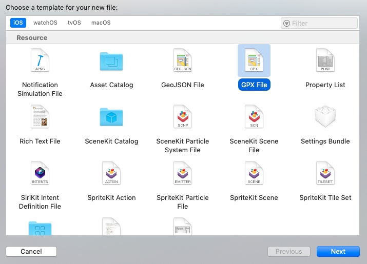
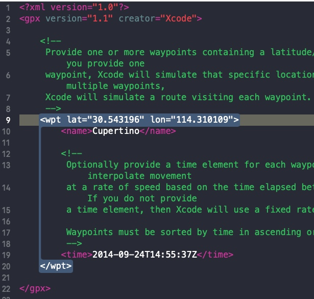
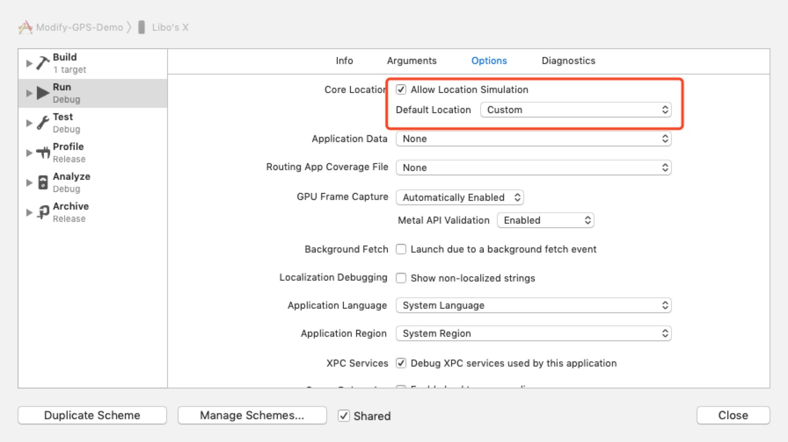
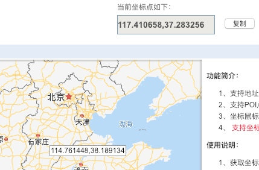
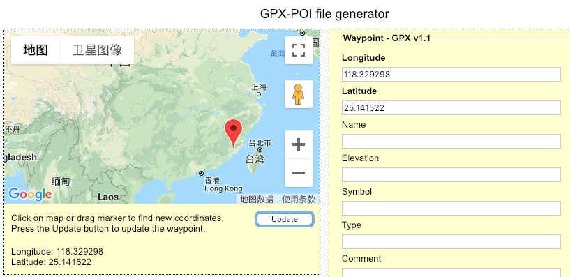

# 免越狱修改 iOS 的 GPS 数据

## 使用 GPX 文件



然后修改文件中的默认经纬度：  



```xml
<?xml version="1.0"?>
<gpx version="1.1" creator="Xcode">
    
    <!--
     Provide one or more waypoints containing a latitude/longitude pair. If you provide one
     waypoint, Xcode will simulate that specific location. If you provide multiple waypoints,
     Xcode will simulate a route visiting each waypoint.
     -->
    <wpt lat="30.543196" lon="114.310109">
        <name>Cupertino</name>
        
        <!--
         Optionally provide a time element for each waypoint. Xcode will interpolate movement
         at a rate of speed based on the time elapsed between each waypoint. If you do not provide
         a time element, then Xcode will use a fixed rate of speed.
         
         Waypoints must be sorted by time in ascending order.
         -->
        <time>2014-09-24T14:55:37Z</time>
    </wpt>
    
</gpx>
```

## 修改 Scheme




然后 run 工程即可。

## 拾取坐标系统

#### 国内的工具（有位置偏移）

http://api.map.baidu.com/lbsapi/getpoint/index.html



#### 国外的（应该没有位置偏移）

http://gpx-poi.com/  




## phantomgps

另一个更加灵活的方案是买这个设备。  

http://phantomgps.com    

[原理](http://phantomgps.com/faq.html)：  


## 参考资料

https://www.jianshu.com/p/5b05b4760227  
http://www.cocoachina.com/ios/20180126/22022.html  
https://stackoverflow.com/questions/21908356/how-to-set-fake-gps-location-on-ios-real-device  
https://blackpixel.com/writing/2013/05/simulating-locations-with-xcode.html  
 https://en.wikipedia.org/wiki/GPS_Exchange_Format  
 

